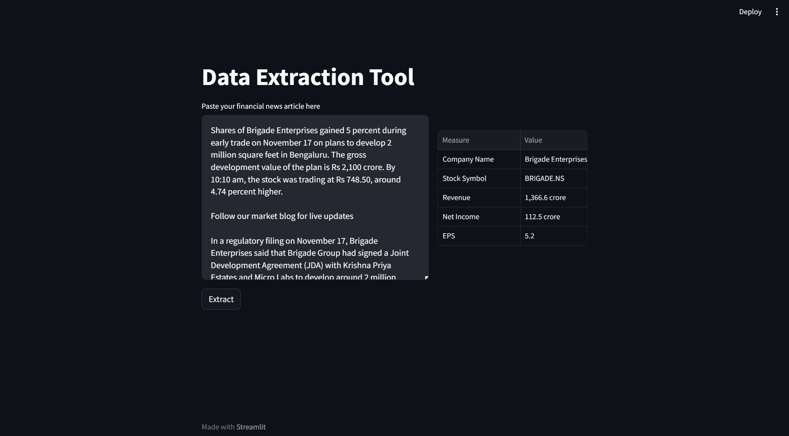

# Finance Data Extraction Tool using openai

Extract the finance data from the news article. Copy and paste the new artice into the text box to extract the finance data.

Before running the app, make sure add the openai api_key under the `.env` file.

Install packages
```
pip install -r requirements.txt
```

To run the app, use the following command.
```
streamlit run main.py
```

